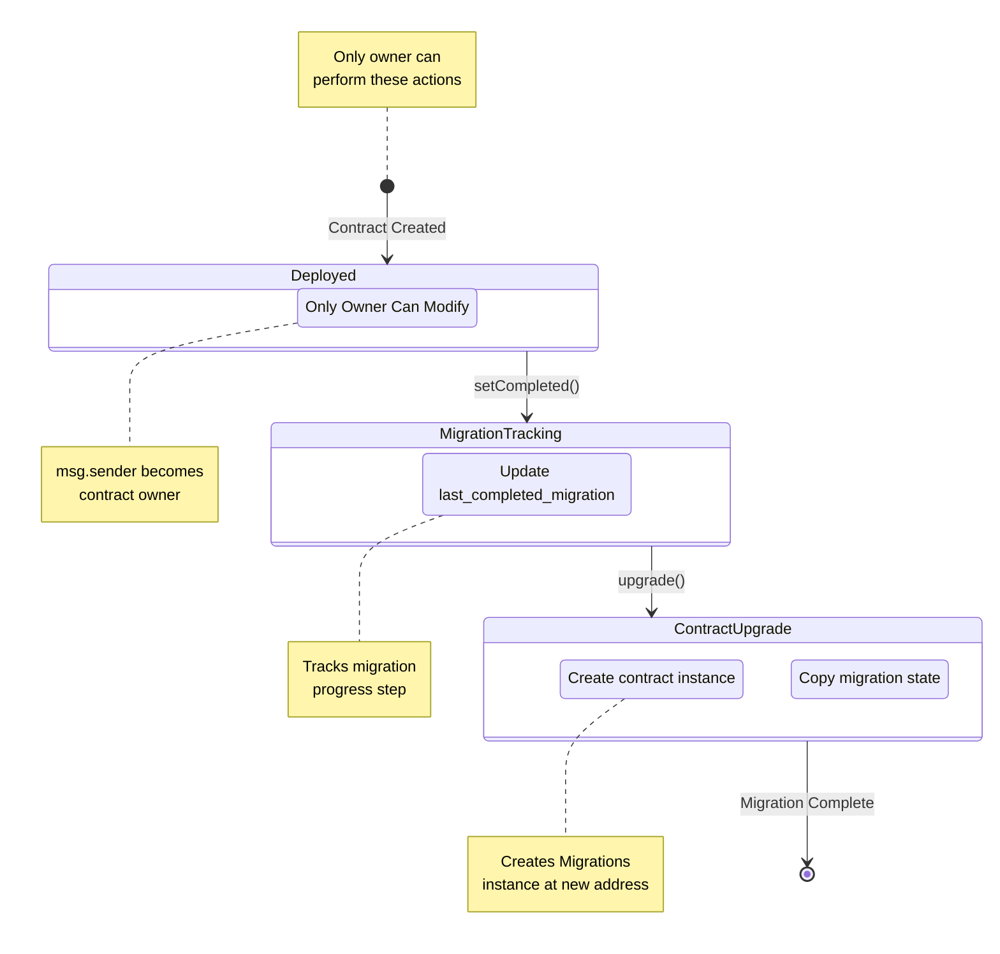

```mermaid
stateDiagram-v2
    [*] --> Deployed: Contract Created
    state Deployed {
        direction LR
        Owner: Only Owner Can Modify
        note right of Owner
            msg.sender becomes 
            contract owner
        end note
    }
    
    Deployed --> MigrationTracking: setCompleted()
    state MigrationTracking {
        direction LR
        TrackProgress: Update last_completed_migration
        note right of TrackProgress
            Tracks migration 
            progress step
        end note
    }
    
    MigrationTracking --> ContractUpgrade: upgrade()
    state ContractUpgrade {
        direction LR
        CreateNewInstance: Create contract instance
        TransferState: Copy migration state
        note right of CreateNewInstance
            Creates Migrations 
            instance at new address
        end note
    }
    
    ContractUpgrade --> [*]: Migration Complete
    
    note left of [*]
      Only owner can 
      perform these actions
    end note
```